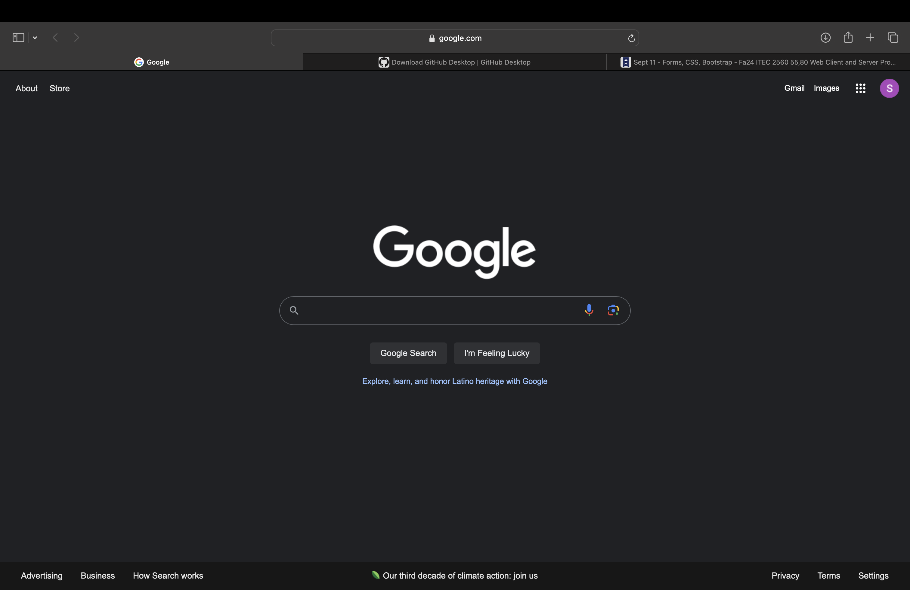

# Extra Credit

## 1. UX Design Investigation

### Good UX Example

- **Website**: [Google Search](https://www.google.com)
- **Why it's good**: Google's search interface is clean, minimal, and intuitive. The input field is highly visible, and users can easily understand how to search. The results are fast and relevant.

### Bad UX Example

- **Website**: [Ling's Cars](https://www.lingscars.com)
- **Why it's bad**: The website is overloaded with unnecessary elements, flashy animations, and confusing navigation. Users find it hard to focus on the main task due to the chaotic design and constant distractions.

---

